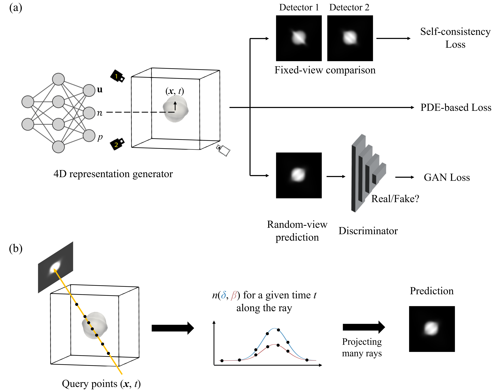

# 4D-PIONIX

This repository contains the code used for 4D-PIONIX (4D physics-informed optimized neural implicit X-ray imaging). For more detailed information about ONIX training and performance, please refer to our paper [Physics-informed 4D X-ray image reconstruction from ultra-sparse spatiotemporal data](https://arxiv.org/abs/2504.03469).

<p align="center">

</p>

## Getting Started
### Prerequisites

- Linux (not tested for MacOS or Windows)
- Python3
- NVIDIA GPU (not tested for CPU)

### Installation
Clone this repo:

```
git clone https://github.com/yzs1417/4D-PIONIX
cd 4D-PIONIX
```
To install the required python packages via Anaconda:

```
conda env create -f environment.yml
conda activate pytorch02
```

### Train instruction
```
python3 train_15frames_pinn.py
```
Some key options can be easily modified in "train_15frames_pinn.py".

## Acknowledgments
The codes were developed based on [GRAF](https://github.com/autonomousvision/graf), [ONIX](https://github.com/pvilla/ONIX) and [4D-ONIX](https://github.com/yuhez/4D-ONIX/).
